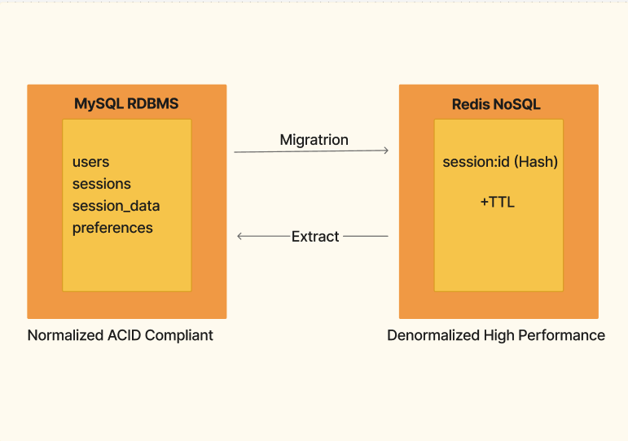
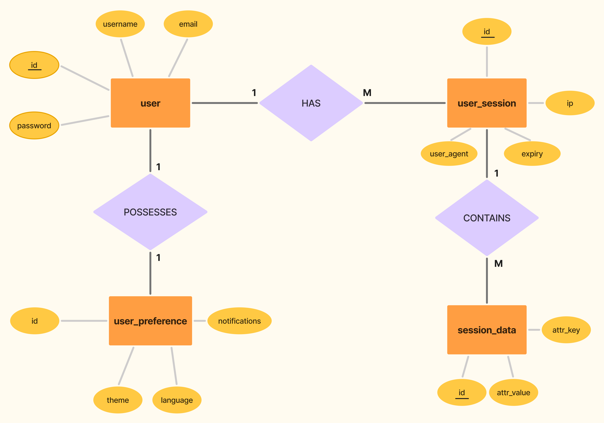
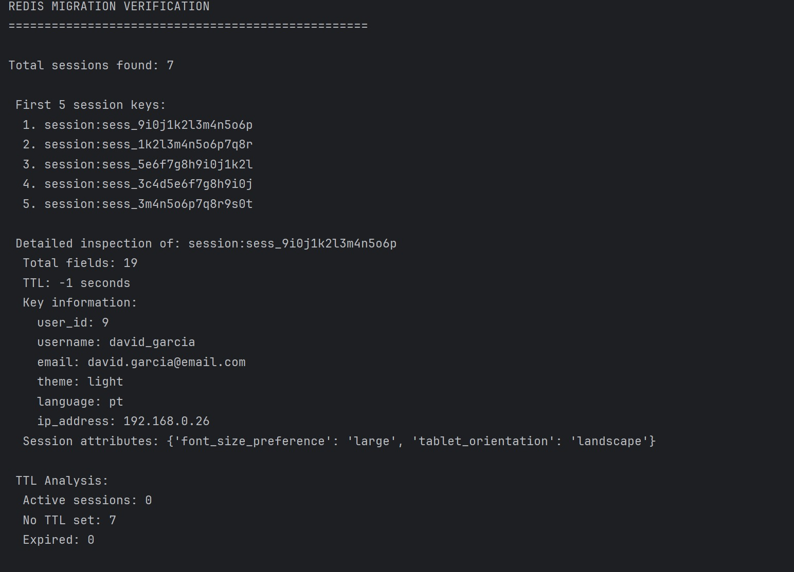
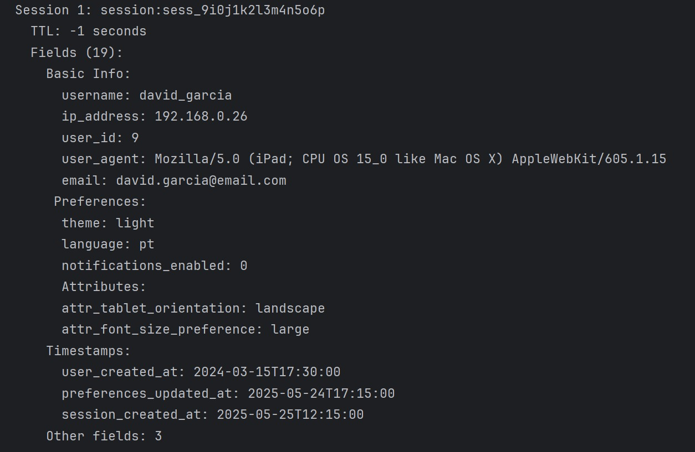
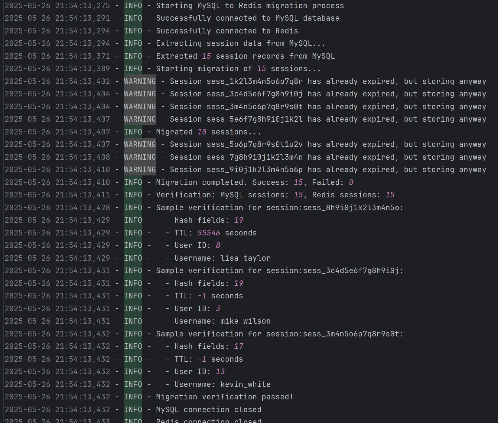

# User Session Management: MySQL to Redis Migration Project

[](https://www.python.org/downloads/)
[](https://www.mysql.com/)
[](https://redis.io/)
[](https://www.docker.com/)

## 📑 Table of Contents
- [Project Overview](#-project-overview)
- [System Architecture](#-system-architecture)
- [ER Diagram](#-er-diagram)
- [Migration Strategy](#-migration-strategy)
- [Getting Started](#-getting-started)
- [Project Structure](#-project-structure)
- [Verification & Testing](#-verification--testing)
- [Technologies Used](#-technologies-used)
- [Project Working/Output Views](#-project-workingoutput-views)
- [Error Handling & Recovery](#-error-handling--recovery)
- [Additional Documentation](#-additional-documentation)

## 📋 Project Overview

This project, developed as part of a **NoSQL Databases course**, demonstrates a thorough understanding of NoSQL concepts and best practices by migrating user session data from a traditional **MySQL relational database** to a high-performance **Redis key-value store**. The migration highlights the shift from normalized relational schemas to denormalized NoSQL models, showcasing how Redis can be effectively leveraged for scalable, low-latency session management in real-world applications.

### 🎯 **Project Objectives**

1. **Design a normalized relational database** for user session management
2. **Implement data modeling strategies** for Redis key-value storage
3. **Develop programmatic migration tools** with comprehensive error handling
4. **Demonstrate performance benefits** of NoSQL for session data

## 🏗️ **System Architecture**


## 📊 **ER Diagram**


### **MySQL Relational Schema (Source)**

Our source database follows **3NF normalization** principles:

#### **Core Entities:**
- **`users`** - User account information
- **`user_sessions`** - Active user sessions
- **`session_data`** - Key-value session attributes  
- **`user_preferences`** - User application preferences

#### **Key Relationships:**
- **Users ← (1:M) → Sessions** - One user can have multiple sessions
- **Sessions ← (1:M) → Session Data** - One session contains multiple attributes
- **Users ← (1:1) → Preferences** - Each user has one preference set

### **Redis NoSQL Schema (Target)**

Data is **denormalized** into Redis Hashes for optimal performance:

```redis
Key Pattern: session:{session_id}
Data Structure: Hash

Fields:
├── user_id, username, email          # User info (from users table)
├── ip_address, user_agent            # Session metadata
├── theme, language, notifications    # User preferences  
├── attr_cart_items, attr_*          # Session-specific data
├── session_created_at, expires_at    # Timestamps
└── migrated_at, migration_version    # Migration metadata
```

## 🔄 **Migration Strategy**

### **ETL Process:**

1. **Extract** - Complex SQL JOINs gather related data from multiple tables
2. **Transform** - Convert relational data to Redis-compatible format
3. **Load** - Store as denormalized Redis Hashes with automatic TTL

### **Key Features:**

- ✅ **Denormalization** - Multiple table data combined into single Redis objects
- ✅ **Automatic TTL** - Session expiry handled natively by Redis
- ✅ **Type Conversion** - Proper handling of timestamps, booleans, JSON data
- ✅ **Error Handling** - Comprehensive logging and recovery mechanisms
- ✅ **Data Verification** - Post-migration integrity checks

## 🚀 **Getting Started**

### **Prerequisites**

- Python 3.8+
- MySQL 8.0+
- Redis 6.0+
- Docker & Docker Compose (for containerized deployment)

### **Quick Start with Docker**

1. **Clone the repository:**
```bash
git clone https://github.com/bekimzeqiri/User-Session-Management-MySQL-to-Redis-Migration.git
cd User-Session-Management-MySQL-to-Redis-Migration
```

2. **Start the complete environment:**
```bash
docker-compose up -d
```

3. **View migration results:**
```bash
# Check migration logs
docker logs migration_tool

# Access Redis web interface
open http://localhost:8081

# Access MySQL web interface  
open http://localhost:8080
```

### **Manual Setup**

1. **Install dependencies:**
```bash
pip install -r requirements.txt
```

2. **Setup databases:**
```bash
# Create MySQL database
mysql -u root -p -e "CREATE DATABASE user_session_management;"
mysql -u root -p user_session_management < sql/01_schema.sql
mysql -u root -p user_session_management < sql/02_sample_data.sql

# Start Redis
redis-server
```

3. **Configure connection:**
```bash
# Copy the example environment file
cp .env.example .env

# Edit .env with your database credentials
# MYSQL_HOST=localhost
# MYSQL_PORT=3306
# MYSQL_USER=your_username
# MYSQL_PASSWORD=your_password
# MYSQL_DATABASE=user_session_management
# REDIS_HOST=localhost
# REDIS_PORT=6379
# REDIS_DB=0
# REDIS_PASSWORD=
```

4. **Run migration:**
```bash
python migration.py
```

## 📁 **Project Structure**

```
User-Session-Management-MySQL-to-Redis-Migration/
├── README.md                 # This file
├── requirements.txt          # Python dependencies
├── .env.example              # Template config
├── Dockerfile                # Container image definition
├── docker-compose.yml        # Multi-service orchestration
│
├── migration.py              # Main migration script
├── check_redis.py            # Redis verification tool
│
├── sql/
│   ├── sql_schema.sql        # MySQL table definitions
│   └── sql_sample_data.sql   # Sample data for testing
│
├── images/
│   ├── er_diagram.png              # Entity-Relationship diagram
│   ├── logs.jpeg                   # Logs
│   ├── redis_migration_view.jpeg   # Redis view after migration
│   ├── redis_session_view.jpeg     # Redis session view
│   ├── mysql_tables.jpeg           # MySQL tables populated with sample data view
│   ├── arch.png                    # System Architecture diagram
│
└── logs/
    └── migration.log        # Migration execution logs
```

## 🔍 **Verification & Testing**

### **Automated Verification**
```bash
# Run comprehensive verification
python check_redis.py
```

### **Manual Testing**
```bash
# Check migrated sessions
redis-cli KEYS "session:*"

# Inspect specific session
redis-cli HGETALL session:sess_1a2b3c4d5e6f7g8h

# Verify TTL settings
redis-cli TTL session:sess_1a2b3c4d5e6f7g8h

# Count total sessions
redis-cli EVAL "return #redis.call('keys', 'session:*')" 0
```

### **Expected Results**
- ✅ **Count Match** - Redis sessions = MySQL sessions
- ✅ **Data Integrity** - All fields properly migrated and typed
- ✅ **TTL Configuration** - Sessions expire based on MySQL `expires_at`
- ✅ **Performance Improvement** - Single Redis lookup vs multiple SQL JOINs

## 🛠️ **Technologies Used**

### **Backend Technologies:**
- **Python 3.8+** - Migration scripting language
- **MySQL 8.0** - Source relational database
- **Redis 6.0+** - Target NoSQL key-value store

### **Python Libraries:**
- **mysql-connector-python** - MySQL database connectivity
- **redis-py** - Redis client library
- **logging** - Comprehensive error tracking

### **DevOps & Deployment:**
- **Docker** - Containerization platform
- **Docker Compose** - Multi-service orchestration
- **Redis Commander/Cli** - Redis interface
- **phpMyAdmin/PyCharm** - MySQL interface

## 🛠️ **Project Working/Output Views**

- MySQL tables populated with sample data  
  

- Redis sessions after migration  
  

- Redis session  
  

- Logs  
  


## 🔄 **Error Handling & Recovery**

The migration system includes comprehensive error handling and recovery mechanisms:

### **Error Prevention**
- **Data Validation** - Validates data types and formats before migration
- **Connection Retries** - Automatically retries failed database connections
- **Transaction Management** - Uses transactions for atomic operations

### **Error Logging**
- **Detailed Logging** - Comprehensive logging of all operations and errors
- **Log Rotation** - Prevents log files from growing too large
- **Error Classification** - Categorizes errors by severity and type

### **Recovery Mechanisms**
- **Partial Migration Recovery** - Can resume migration from the last successful point
- **Data Verification** - Verifies migrated data integrity
- **Rollback Capability** - Can roll back changes if verification fails


## 📖 **Additional Documentation**
For detailed documentation, reporting and additional resources, click on the link below:
### [A Comprehensive Guide to Migrating Relational User Session Data to a Key-Value Store (Redis)](https://github.com/bekimzeqiri/User-Session-Management-MySQL-to-Redis-Migration/wiki).
